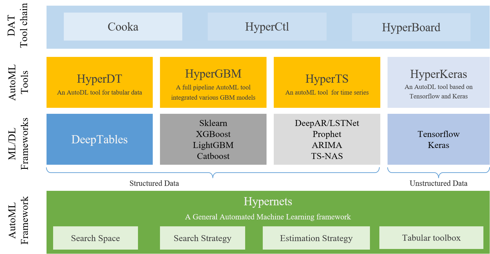

# HyperBoard

[中文](README_CN.md)

HyperBoard is a visualization tool designed for Hypernets.

HyperBoard contains three projects which are listed below：
- [hboard](./hboard): provides a visualization tool for experiment information based on the web.
- [hboard-widget](./hboard-widget): provides a visualization tool for experiment information based on jupyter notebook widget.
- [hboard-frontend](./hboard-frontend): provides a frontend visualization library for Hypernets.

An example of the experiment information dashboard：

## HyperBoard related projects
 
* [Hypernets](https://github.com/DataCanvasIO/Hypernets): A general automated machine learning (AutoML) framework.
* [HyperGBM](https://github.com/DataCanvasIO/HyperGBM): A full pipeline AutoML tool integrated various GBM models.
* [HyperDT/DeepTables](https://github.com/DataCanvasIO/DeepTables): An AutoDL tool for tabular data.
* [HyperTS](https://github.com/DataCanvasIO/HyperTS): A full pipeline AutoML&AutoDL tool for time series datasets.
* [HyperKeras](https://github.com/DataCanvasIO/HyperKeras): An AutoDL tool for Neural Architecture Search and Hyperparameter Optimization on Tensorflow and Keras.
* [Cooka](https://github.com/DataCanvasIO/Cooka): Lightweight interactive AutoML system.

## DataCanvas
HyperBoard is an open source project created by [DataCanvas](https://www.datacanvas.com/).
