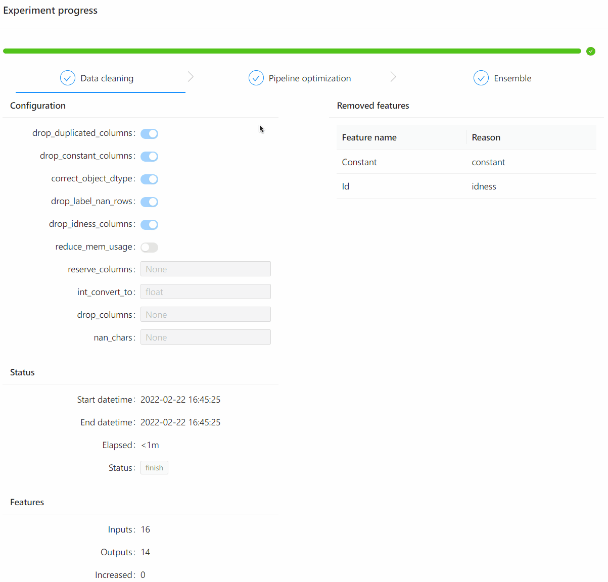

# experiment-visualization

[](https://pypi.org/project/experiment-visualization)
[](https://pepy.tech/project/experiment-visualization)
[](https://pypi.org/project/experiment-visualization)

[中文](README_zh_CN.md)

This project provides a web based visualization tool for experiment information. In general, Hypernets writes the experiment events into a text file. This tool could monitor the file and make these events visible.



## Installation

**Install with pip**
```shell
pip install experiment-visualization
```

**Install with conda**
```shell
conda install -c conda-forge experiment-visualization
```

**Install with source code**

Create a frontend project after installing the front-end library [experiment-visualization-frontend](../experiment-visualization-frontend):

1. Create the required software environment：

- [nodejs v14.15.0+](https://nodejs.org/en/)

2. Besides, this project requires the package manager ``yarn`` and the module bundler ``webpack``. Install them by the following command:

```
npm install -g webpack webpack-cli yarn
```

Clone the project codes：
```shell
git clone https://github.com/DataCanvasIO/HyperBoard.git
```

Creat a project：
```shell
cd HyperBoard/experiment-visualization/js

# build frontend
yarn
yarn build
rm -rf ../experiment_visualization/assets/
cp -r build/ ../experiment_visualization/assets/

# install 
cd ..
python setup.py install
```

## Example of experiment-visualization 

The folllowing steps shows how to implement the experiment-visualization：
1. Create an empty event file to store the experiment states
```shell
touch events.txt
```

2. Create a web server to monitor the event file
```
from experiment_visualization.app import WebApp
webapp = WebApp("events.txt")
webapp.start()
```
The web server outputs logs as：
```shell
02-24 20:45:58 I experiment_visualization.app.py 77 - experiment visualization http server is running at: http://0.0.0.0:8888
```
The web can be accessed via [http://localhost:8888](http://localhost:8888)。

3. Add detailed experiment events to the file 'event.txt' by command:

```shell
echo '{"type": "experimentStart", "payload": {"task": "binary", "datasets": [{"kind": "Train", "task": "binary", "shape": [904, 17], "memory": 123072}], "steps": [{"index": 0, "name": "data_clean", "type": "DataCleanStep", "status": "wait", "configuration": {"cv": true, "data_cleaner_args": {"nan_chars": null, "correct_object_dtype": true, "drop_constant_columns": true, "drop_label_nan_rows": true, "drop_idness_columns": true, "drop_columns": null, "reserve_columns": null, "drop_duplicated_columns": false, "reduce_mem_usage": false, "int_convert_to": "float"}, "name": "data_clean", "train_test_split_strategy": null}, "extension": {}, "start_datetime": null, "end_datetime": null}, {"index": 1, "name": "space_searching", "type": "SpaceSearchStep", "status": "wait", "configuration": {"cv": true, "name": "space_searching", "num_folds": 3, "earlyStopping": {"enable": true, "exceptedReward": null, "maxNoImprovedTrials": 10, "timeLimit": 3600, "mode": "max"}}, "extension": {}, "start_datetime": null, "end_datetime": null}, {"index": 2, "name": "final_ensemble", "type": "EnsembleStep", "status": "wait", "configuration": {"ensemble_size": 20, "name": "final_ensemble", "scorer": "make_scorer(accuracy_score)"}, "extension": {}, "start_datetime": null, "end_datetime": null}], "evaluation_metric": null, "confusion_matrix": null, "resource_usage": null, "prediction_stats": null}}' >> events.txt
```

Now the web initialization is finished. The Hypernets experiment writes the events by callback. The web will update the lastest experiment states automatically.

## Visualization when the experiment is finished 

Once `experiment-visualization` installed, use the command 'hyperboard' to visualize the finished experiment.

```shell
hyperboard -h
usage: hyperboard [-h] {server} ...

hyperboard command is used to visualize the experiment

positional arguments:
  {server}
    server    start webserver

optional arguments:
  -h, --help  show this help message and exit
```

 See example below:
1. Clone the codes
```shell
git clone https://github.com/DataCanvasIO/HyperBoard.git
```
2. Start the web server and load the experiment data
```shell
cd HyperBoard
hyperboard server --event-file=experiment-visualization/experiment_visualization/tests/events_example.json
```
View the experiment dashboard via [http://localhost:8888](http://localhost:8888).

## Related project

Currently, [HyperGBM](https://github.com/DataCanvasIO/HyperGBM) has integrated this tool. The HyperGBM experiment could callback the web visualization function and display the experiment dashboard. Please refer to [Experiment Visualization](https://hypergbm.readthedocs.io/en/latest/example_basic.html#experiment-visualization)。
