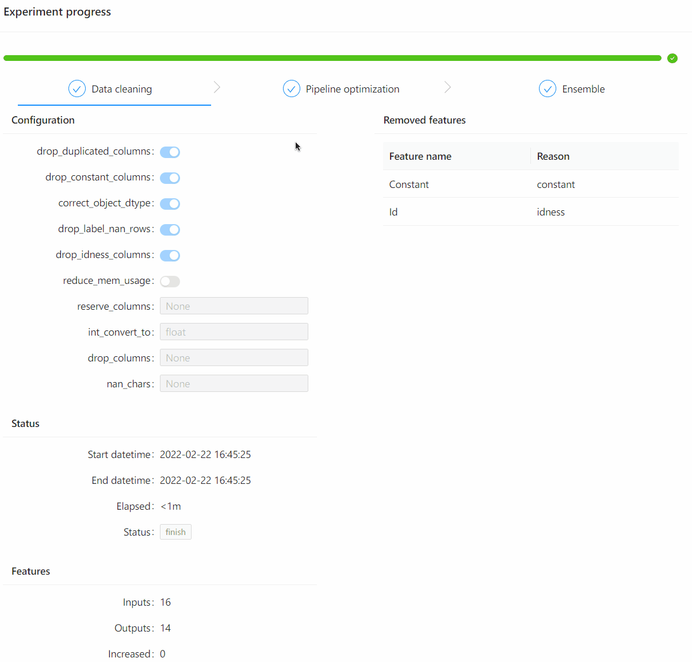

# hboard

[](https://pypi.org/project/hboard)
[](https://pepy.tech/project/hboard)
[](https://pypi.org/project/hboard)


这个项目用来为Hypernets提供基于web的实验可视化功能。
Hypernets实验在运行过程中将运行事件写入到文件中，此项目通过监控这个文件来获取实验运行的状态并进行可视化：


### 安装

**使用pip安装**
```shell
pip install hboard
```

**使用conda安装**
```shell
conda install -c conda-forge hboard
```

**使用源码**

它依赖前端可视化组件库[hboard-frontend](../hboard-frontend)，开始构建前请先构建此项目。

构建所需要的软件环境：
- [nodejs v14.15.0+](https://nodejs.org/en/)

这个项目的前端部分使用yarn管理依赖、webpack构建，安装这两个工具：
```
npm install -g webpack webpack-cli yarn
```

克隆代码：
```shell
git clone https://github.com/DataCanvasIO/HyperBoard.git
```

构建并安装项目：
```shell
cd HyperBoard/hboard/js

# build frontend
yarn
yarn build
rm -rf ../hboard/assets/
cp -r build/ ../hboard/assets/

# install 
cd ..
python setup.py install
``` 
### 使用hboard可视化实验
下面将以一个例子演示hboard是如何可视化实验的：
1. 创建实验可视化数据文件
```shell
touch events.txt
```

2. 创建web服务监控实验可视化数据文件
```
from hboard.app import WebApp
webapp = WebApp("events.txt")
webapp.start()
```
输出日志：
```shell
02-24 20:45:58 I hboard.app.py 77 - experiment visualization http server is running at: http://0.0.0.0:8888
```
此时请打开浏览器访问[http://localhost:8888](http://localhost:8888)。

3. 通过命令向`events.txt`文件中追加样例实验事件

```shell
echo '{"type": "experimentStart", "payload": {"task": "binary", "datasets": [{"kind": "Train", "task": "binary", "shape": [904, 17], "memory": 123072}], "steps": [{"index": 0, "name": "data_clean", "type": "DataCleanStep", "status": "wait", "configuration": {"cv": true, "data_cleaner_args": {"nan_chars": null, "correct_object_dtype": true, "drop_constant_columns": true, "drop_label_nan_rows": true, "drop_idness_columns": true, "drop_columns": null, "reserve_columns": null, "drop_duplicated_columns": false, "reduce_mem_usage": false, "int_convert_to": "float"}, "name": "data_clean", "train_test_split_strategy": null}, "extension": {}, "start_datetime": null, "end_datetime": null}, {"index": 1, "name": "space_searching", "type": "SpaceSearchStep", "status": "wait", "configuration": {"cv": true, "name": "space_searching", "num_folds": 3, "earlyStopping": {"enable": true, "exceptedReward": null, "maxNoImprovedTrials": 10, "timeLimit": 3600, "mode": "max"}}, "extension": {}, "start_datetime": null, "end_datetime": null}, {"index": 2, "name": "final_ensemble", "type": "EnsembleStep", "status": "wait", "configuration": {"ensemble_size": 20, "name": "final_ensemble", "scorer": "make_scorer(accuracy_score)"}, "extension": {}, "start_datetime": null, "end_datetime": null}], "evaluation_metric": null, "confusion_matrix": null, "resource_usage": null, "prediction_stats": null}}' >> events.txt
```

然后切换到浏览器中观察实验已经初始化完成。
Hypernets实验在集成`hboard`时通过callback将实验的事件写入到文件中，网页端定时进行增量刷新达到动态更新实验运行状态的效果。

### 命令行工具

安装完`hboard`可以通过hboard命令可以加载已经完成的实验的可视化数据：
```shell
hboard -h
usage: hboard [-h] {server} ...

hboard command is used to visualize the experiment

positional arguments:
  {server}
    server    start webserver

optional arguments:
  -h, --help  show this help message and exit
```

以加载示例实验数据为例子：
1. 克隆代码
```shell
git clone https://github.com/DataCanvasIO/HyperBoard.git
```
2. 启动web服务并加载数据。
```shell
cd HyperBoard
hboard server --event-file=hboard/hboard/tests/events_example.json
```
在浏览器中访问[http://localhost:8888](http://localhost:8888) 查看实验可视化。

### 相关项目

目前[HyperGBM](https://github.com/DataCanvasIO/HyperGBM)已经集成此工具，在HyperGBM实验的callback中会将实验的事件写到文件中，并启动Web服务，请参考文档[实验可视化](https://hypergbm.readthedocs.io/zh_CN/latest/example_basic.html#web)。

