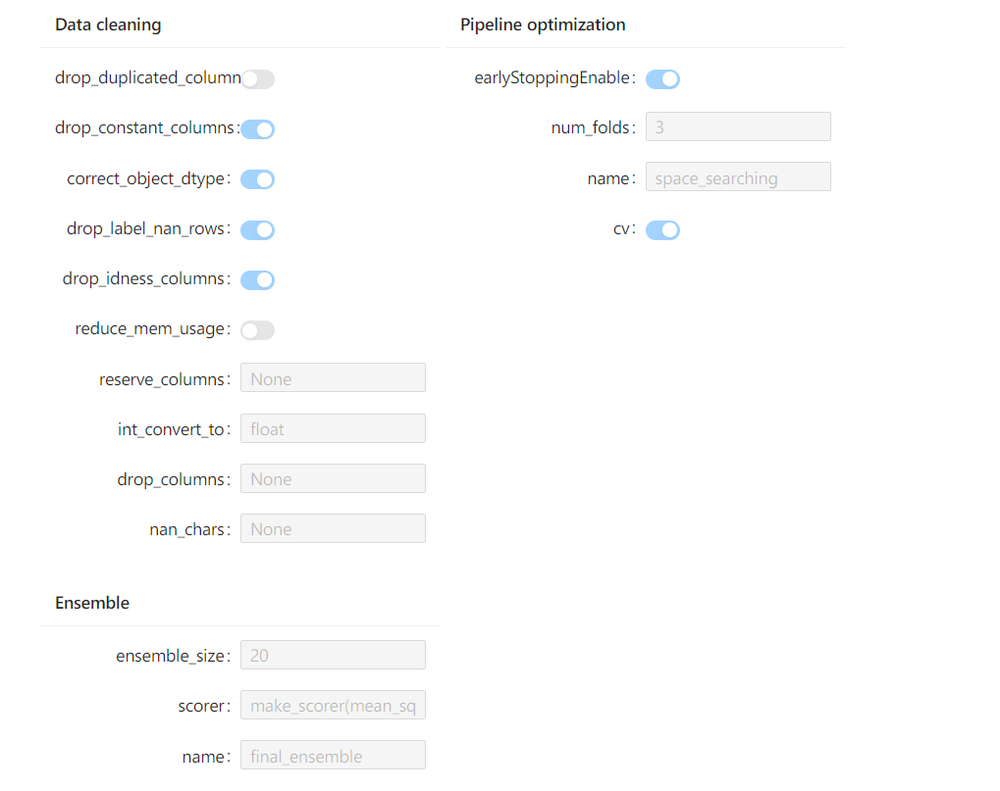
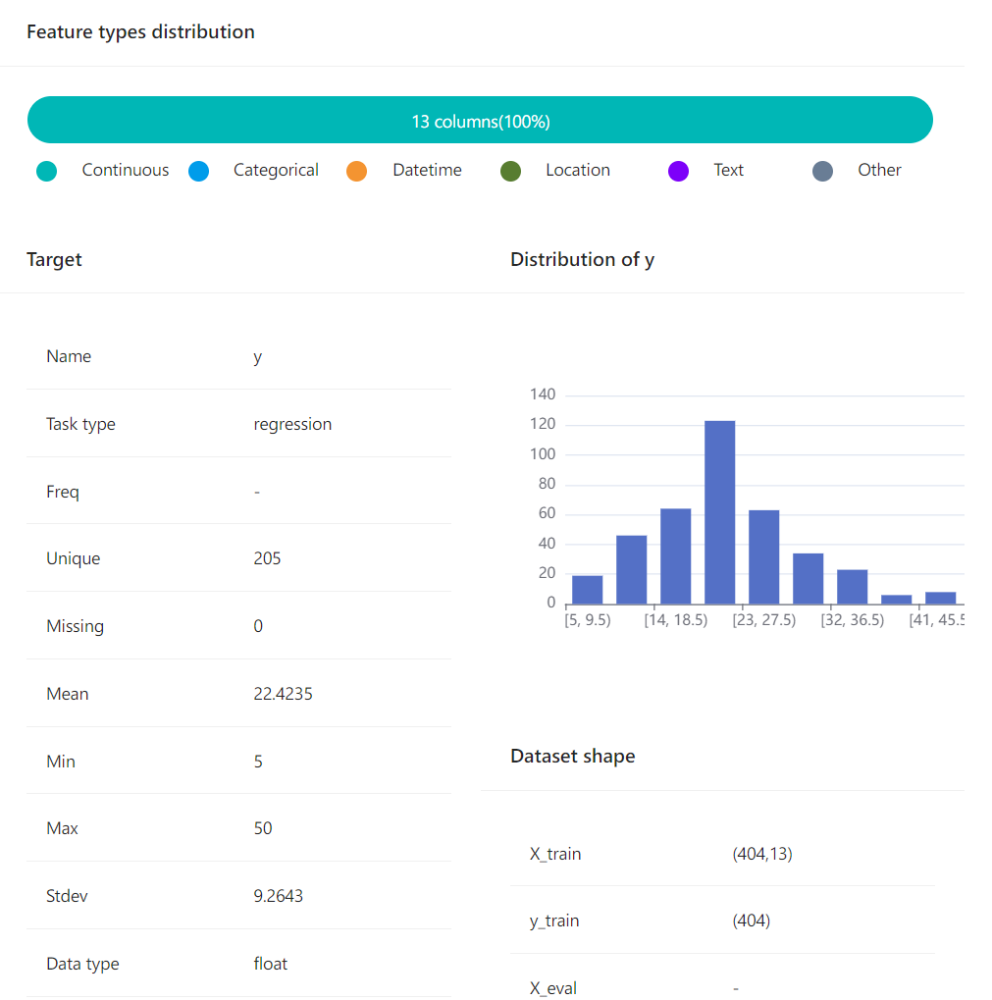

# experiment-notebook-widget

[](https://pypi.org/project/experiment-notebook-widget)
[](https://pepy.tech/project/experiment-notebook-widget)
[](https://pypi.org/project/experiment-notebook-widget)

[中文](README_zh_CN.md)

This project provides a visualization tool for experiment information based on jupyter notebook/ jupyterlab widget.

## Installation

**Install with pip**
```shell
pip install hyperboard-widget
```

**Install with conda**
```shell
conda install -c conda-forge hyperboard-widget
```

**Install with source code**

1. Create the required software environment：
- [python 3.7+](https://python.org)
- [nodejs v14.15.0+](https://nodejs.org/en/)
- [pip 20.0.2+](https://pypi.org/project/pip/)
- [jupyterlab 2.0.0+ ](https://jupyter.org/)
- [jupyter-notebook 6.4+](https://jupyter-notebook.readthedocs.io/en/stable/notebook.html)


2. Clone the soure code:
```bash
git clone https://github.com/DataCanvasIO/HyperBoard.git
```

3. Create a project：
```bash
cd hyperboard-widget
pip install -e .
```

## Example 

The folllowing steps shows how to implement the experiment visualization in notebook

1. Import the required modules：
```python
import warnings
warnings.filterwarnings('ignore')

from sklearn.model_selection import train_test_split
from hypernets.examples.plain_model import PlainModel, PlainSearchSpace
from hypernets.experiment import make_experiment
from hypernets.tabular.datasets import dsutils
```

2. Create an experiment
```python
df = dsutils.load_boston()
df_train, df_eval = train_test_split(df, test_size=0.2)
search_space = PlainSearchSpace(enable_lr=False, enable_nn=False, enable_dt=False, enable_dtr=True)
experiment = make_experiment(PlainModel, df_train,
                             target='target',
                             search_space=search_space,
                             callbacks=[],
                             search_callbacks=[])
```

3. Experiment visualization configurations
```python
from experiment_notebook_widget import ExperimentSummary
experiment_summary_widget = ExperimentSummary(experiment)
display(experiment_summary_widget)
```




4. Visualize the dataset information

```python
from experiment_notebook_widget import DatasetSummary
dataset_summary_widget = DatasetSummary(experiment.get_data_character())
display(dataset_summary_widget)
```




5. Visualize the experiment process

```python
from experiment_notebook_widget import ExperimentProcessWidget
estimator = experiment.run(max_trials=3)

widget = ExperimentProcessWidget(experiment)
display(widget)
```


Find the project in Notebook [experiment visualization notebook.ipynb](experiment_notebook_widget/examples/01.visual_experiment.ipynb).


## Related project

Currently, [HyperGBM](https://github.com/DataCanvasIO/HyperGBM) has integrated this tool. The HyperGBM experiment could call the notebook widget visualization function and display the experiment dashboard. Please refer to [HyperGBM: Experiment Visualization in Notebook](https://hypergbm.readthedocs.io/en/latest/quick_start_notebook.html)


