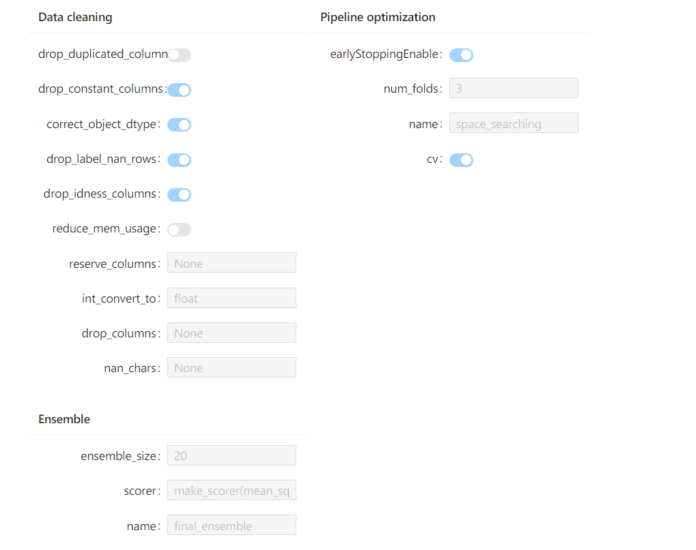

# experiment-notebook-widget

[](https://pypi.org/project/experiment-notebook-widget)
[](https://pepy.tech/project/experiment-notebook-widget)
[](https://pypi.org/project/experiment-notebook-widget)

这个jupyter插件用来在jupyter notebook 或者jupyterlab中可视化hypernets实验运行过程:

## Installation

**使用pip安装**
```shell
pip install hyperboard-widget
```

**使用conda安装**
```shell
conda install -c conda-forge hyperboard-widget
```

**使用源码构建安装**

构建所需要的软件环境：
- [python 3.7+](https://python.org)
- [nodejs v14.15.0+](https://nodejs.org/en/)
- [pip 20.0.2+](https://pypi.org/project/pip/)
- [jupyterlab 2.0.0+ ](https://jupyter.org/)
- [jupyter-notebook 6.4+](https://jupyter-notebook.readthedocs.io/en/stable/notebook.html)


准备好安装环境后克隆源码:
```bash
git clone https://github.com/DataCanvasIO/HyperBoard.git
```

安装项目：
```bash
cd hyperboard-widget
pip install -e .
```

## 使用插件可视化实验

下面将通过一个例子展示如何在Notebook中可视化实验。


1. 导入模块：
```python
import warnings
warnings.filterwarnings('ignore')

from sklearn.model_selection import train_test_split
from hypernets.examples.plain_model import PlainModel, PlainSearchSpace
from hypernets.experiment import make_experiment
from hypernets.tabular.datasets import dsutils
```

2. 构建实验
```python
df = dsutils.load_boston()
df_train, df_eval = train_test_split(df, test_size=0.2)
search_space = PlainSearchSpace(enable_lr=False, enable_nn=False, enable_dt=False, enable_dtr=True)
experiment = make_experiment(PlainModel, df_train,
                             target='target',
                             search_space=search_space,
                             callbacks=[],
                             search_callbacks=[])
```

3. 可视化实验配置
```python
from experiment_notebook_widget import ExperimentSummary
experiment_summary_widget = ExperimentSummary(experiment)
display(experiment_summary_widget)
```




4. 可视化数据集信息

```python
from experiment_notebook_widget import DatasetSummary
dataset_summary_widget = DatasetSummary(experiment.get_data_character())
display(dataset_summary_widget)
```


5. 可视化实验运行过程

```python
from experiment_notebook_widget import ExperimentProcessWidget
estimator = experiment.run(max_trials=3)

widget = ExperimentProcessWidget(experiment)
display(widget)
```


你可以找到这个Notebook在[01.visual_experiment.ipynb](experiment_notebook_widget/examples/01.visual_experiment.ipynb).


## 相关项目

目前[HyperGBM](https://github.com/DataCanvasIO/HyperGBM)已经集成此工具，在HyperGBM实验的callback中启动Notebook的可视化插件，并推送可视化事件，请参考文档[通过Notebook使用HyperGBM](https://hypergbm.readthedocs.io/zh_CN/latest/quick_start_notebook.html)。
